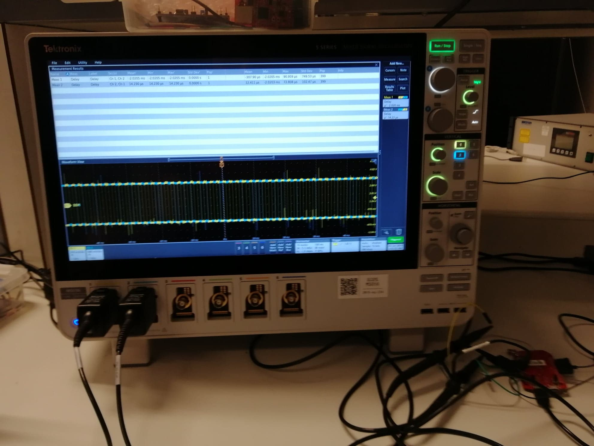

## Overhead measurements

TODO comparisons of overhead
TODO discussion

## Framework measurements

TODO assessment of the different approaches

# Conclusion

## Parallel works

Embench (June 11th, 2019)

---

Embench: Recruiting for the Long Overdue and Deserved Demise of Dhrystone as a Benchmark for Embedded Computing by Prof David Patterson

## Future possible improvements

- Add metrics
- Improve the devices framework

## Demonstration

TODO video ou live demo

---

---

